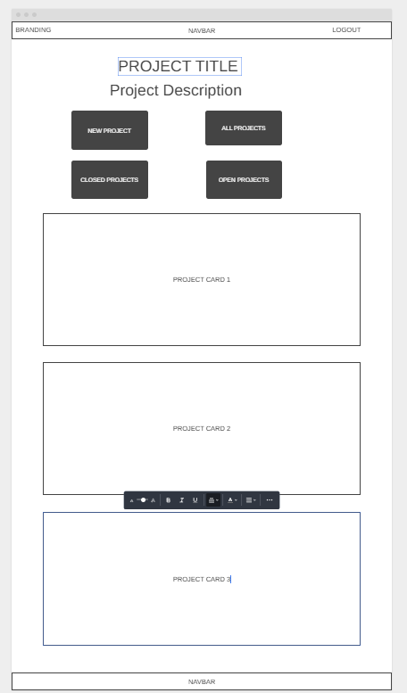
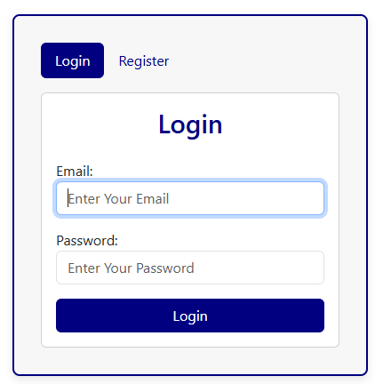
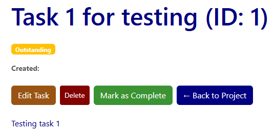
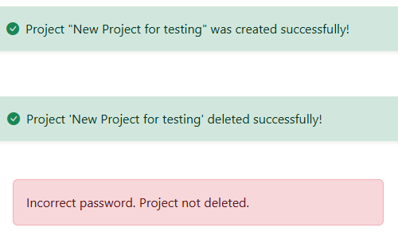
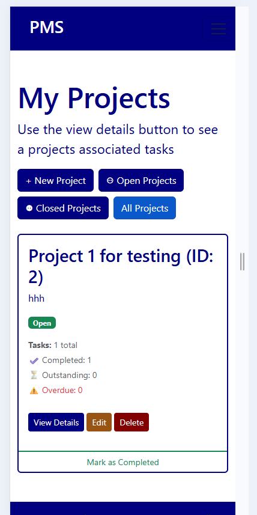
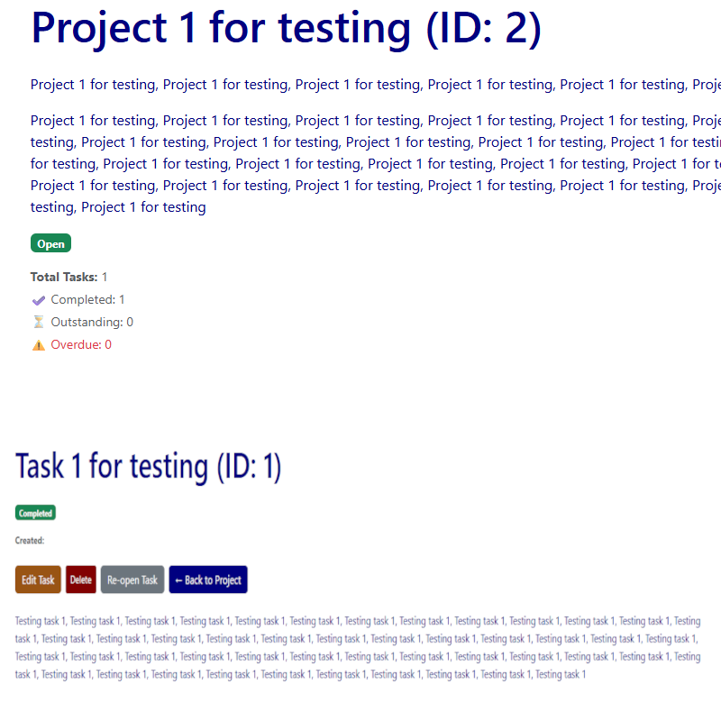
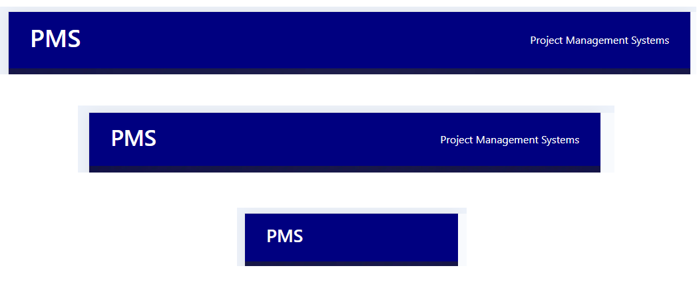
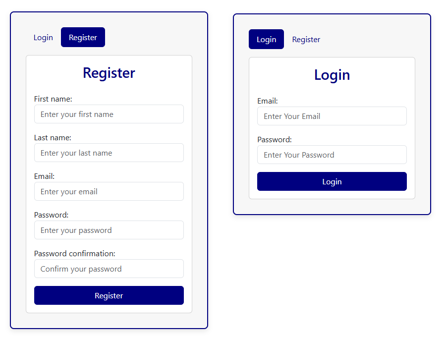
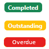

# [project-management-systems-web-application-project-3](https://github.com/JSGREEN1129/web_application_diploma_project_3)

Developer: Josh Green ([JSGREEN1129](https://www.github.com/JSGREEN1129))

## Project Rationale
Build a simple project management system that can be used by small teams to create, edit and manage projects and there associated tasks. In todays world of work digital communications are paramount to effective and successful working, a lot of project or task management system that are currently on the market are overly complex are developed with large teams and organisations at the forefront of the development road map. I want to design and develop something that is simple and easy to use even for those that are not necessarily tech savvy. A development of this nature will familiarise me with the backend development processes and the challenges and difficulties which are present in said environments.

The backend will included functions such as user registration and log-in, creating, editing and deleting projects, creating, associating, editing and deleting tasks, automatically updating the status of a specific task and potentially, assigning tasks to users.

I will be gaining exposure an experience in new technologies and software's that I am yet to explore, thins such as, Django, RESTapi, SQlite and PostgreSQL. I can also further my exposure to technologies that I have already used such as HTML, CSS, Javascript and Bootstrap.

**PMS - Project Management Systems is designed for:**

- SME users who need a simple, efficient, and cost-effective project management system.
- Self-employed tradesman who wants an effective way of logging jobs and the job progress.
- Freelance web developers, digital marketers, and so forth.
- Individuals who are not necessarily 'tech savvy'
- Mobile users who prefer lightweight, responsive web apps on the go
- Users with accessibility needs, such as visual impairments, who benefit from high-contrast colors and readable fonts.

**User Needs and Stories**
To ensure the platform meets real user needs, several user stories were defined and implemented in development:
[user-stories](#user-stories)

**Site Mockups**

## UX

### The 5 Planes of UX

#### 1. Strategy

**Purpose**
- Provide users with a simple and accessible way to create, track and delete projects and associated tasks.
- Provid feedback messages for succesfully executed function logic. I.e 'project created successfully' or 'Task has been deleted'
- Support device based accessibility and device-friendly navigation and interactions.

**Primary User Needs**
- Ease of Access: Users require a simple, efficient, and cost-effective way to manage their projects. They want quick access to project dashboards, timelines, and task statuses, with clear visibility of bottlenecks, overdue tasks, or potential delays. Key information should be surfaced with minimal clicks, ideally from a central overview.
- Value Add: Users expect an intuitive digital product that allows them to track and manage all their projects or jobs in one place. The system should minimise complexity by offering essential tools-such as task tracking, team assignments, and progress updates-in a streamlined, easy-to-use interface that reduces the need for multiple systems.
- Task Filtering and Clarity: Users value the ability to quickly filter and view tasks based on their status—such as completed, outstanding, or overdue. This helps increase focuse and ensures important tasks are not overlooked, clear task filtering supports effective prioritisation and time management.

**Business Goals**
- Increase Engagement and Retention: Encourage both new and returning users to actively use the platform by delivering a reliable, streamlined user experience. Focus on simplicity and clarity to make project tracking efficient and satisfying, supporting both occasional check-ins and daily task management.
- Demonstrate Quality and Accessibility: Establish the system as a professional, well-designed tool that reflects strong usability and accessibility principles. Ensure compatibility across a range of devices and screen sizes, and maintain a clean, intuitive interface that caters to users with varying levels of technical experience.
- Lay the Foundations for Growth: Develop the platform with scalability in mind—ensuring the underlying structure can support future features such as user accounts, team collaboration tools, advanced analytics, or potential integrations. This forward-thinking approach will also support future monetisation opportunities and community-driven expansion.

#### 2. Scope

**[Features](#features)** (see below)

**Content Requirements**
- Clear UI Labels and Instructions: All input fields, action buttons, and navigation elements must be clearly labelled to ensure users understand how to interact with the system at every stage. Tooltips or brief inline guidance should be used where appropriate to support usability.
- Input Validation and Error Feedback: The application should validate all user inputs (e.g., task names, dates, deadlines) and display clear, helpful error messages when inputs are invalid or incomplete. This helps prevent data issues and guides users towards successful task entry or updates.
- Instant Status Updates: Any changes made to tasks—such as marking them as complete or updating a due date—should be reflected immediately in the interface. This ensures users always have an up-to-date view of their project status and reduces confusion.
- Progress Tracking and Performance Insights: A running summary of project or task statuses (e.g., number of completed, outstanding, and overdue tasks) should be displayed clearly. This gives users ongoing visibility into their progress and supports better planning and prioritisation over time.

#### 3. Structure

**Information Architecture**
- **Navigation Menu**:
  - The navigation menu will be intentionally minimal to ensure ease of use. The primary focus will be on the Projects List page, which serves as the central hub. From there, users can access individual projects and view or manage the tasks associated with each project, keeping the navigation intuitive and task-oriented.

- **Hierarchy**:
  - Primary Focus Areas: Core project details and task lists are placed prominently in the centre of the interface to guide user attention. This includes key information such as task names, deadlines, and status indicators.
  - Status Feedback Display: A clear summary of task status (e.g. completed, outstanding, overdue) is displayed in real time to help users monitor progress and identify where action is required.
  - Dynamic Action Buttons: Contextual buttons (e.g. "Mark as Complete", "Edit Task", or "Delete Task") are shown based on task status or user interaction. This encourages continued engagement without overwhelming the interface.
  - Project and Task State Behaviour: When a project is marked as completed, all associated open tasks will automatically be closed. If the project is later reopened, those tasks will be restored to their previous states (e.g. outstanding or in progress), allowing users to easily and quickly rectify any projects closed by mistake.
  - Deletion Safeguards: To prevent accidental deletion, users must confirm their password before permanently deleting any project or task. This adds an extra layer of protection against misclicks or unintended actions, ensuring critical data is not lost without deliberate intent.

**User Flow**
1. User lands on the Home Page and registers an account before being able to login and use the application. Users and auto logged in after registration completion. 
2. User lands on the project list dashboard and is advised to create a new project. If the user already has created projects then the user will see the list of all projects as default on login. Projects can be filtered by open projects, closed projects and all projects.
3. Users can view, edit, delete, close and re-open projects directly from the main Projects List page. Each project card includes: A View Details button that opens the project detail page for an in-depth overview of tasks and progress. An Edit button that navigates to an edit page where users can modify project information. A Delete button that triggers a confirm delete modal, where the user has to enter their correct password to delete the project and a complete project/re-open project button. Users are not required ot enter a password to complete or re-open a project but there is an on screen prompt which requires user interaction to complete the function. 
4. When on the project detail page the user has a similar view to the project list page but it is populated with tasks as oppose to projects (if the user has created tasks associated with that specific project).
5. Users can view, edit, delete, close and re-open tasks directly from the tasks List page. Each task card includes: A View Details button that opens the task detail page. An Edit button that navigates to an edit page where users can modify task information. A Delete button that triggers a confirm delete modal, where the user has to enter their correct password to delete the task and a complete task/re-open task button. 

#### 4. Skeleton

**[Wireframes](#wireframes)** (see below)

**Visual Design Elements**
- **[Colours](#colour-scheme)** (see below)
- **[Typography](#typography)** (see below)

#### 5. Surface

**Visual Design Elements**
- **[Colours](#colour-scheme)** (see below)
- **[Typography](#typography)** (see below)

### Colour Scheme

- `#000080` Background - Main site background, providing strong contrast and a modern, sleek appearance.
- `ffffff` Primary Text - Default text colour, ensuring high contrast and readability against dark background.
- `#000080` Primary Accent - Main brand colour used for most buttons and componants. 
- `#0018f9` Hoover for Primary Accent, to give contrast and user interactibilty. 
- `#820101` Danger - Used for all delete buttons, warnings and errors messages — nice contrast with application colour.
- `d60000` Hoover for Danger componants, to give contrast and user interactibilty. 
- `995414` Edit Buttons - Used for all edit buttons.
- `e3730b` Hoover for edit componants, to give contrast and user interactibilty. 
- `3b9333` Confirm Button - Used for all confirm buttons and success messages — nice contrast with application colour.
- `43c936` Hoover for confirm and succes componants, to give contrast and user interactibilty. 
- `6c757d` Re-open Button - Used for all re-open buttons.
- `43c936` Hoover for re-open to give contrast and user interactibilty.

### Typography

- I used the default font styles applied via bootstrap 5.3. I believe these to be a combination of the below.

- [system-ui]
- [-apple-system]
- [-Roboto]
- [Arial]
- [sans-serif]

## Wireframes

| Page | Desktop | Mobile |
| --- | --- | --- |
| Home |  |  |
| Login/Register |  |  |
| Project list page |  |  |
| Task list page |  |  |
| Project card |  |  |
| Task card |  |  |

### User Stories

| Target | Expectation | Outcome | Proof |
| --- | --- | --- | --- |
| As a user | I want to register and log in securely | so that I can have a personal account to manage my projects and tasks safely. |  |
| As a user | I want to create new projects easily | so that I can organize my work into distinct, manageable units. | |
| As a user | I want to add, edit, and delete tasks within projects | so that I can break down projects into actionable steps and keep my work updated. |  |
| As a user | I want to mark tasks and projects as complete or re-open them | so that I can track progress accurately and update statuses as needed. |  |
| As a user | I want to filter projects and tasks by status (open, closed, overdue) | so that I can quickly focus on what needs immediate attention. |  |
| As a user | I want to see clear feedback messages after actions | so that I know when a project or task has been successfully created, updated, or deleted. |  |
| As a user | I want to protect critical actions (like deleting) with password confirmation | so that I avoid accidental data loss. |   |
| As a user | I want the interface to be mobile-friendly and accessible | so that I can manage projects and tasks efficiently from any device and regardless of visual impairments. |   |
| As a user | I want to view detailed information about each project and its tasks | so that I can get a comprehensive overview and manage work effectively.|   |
| As a user | I want automatic updates of task statuses when project status changes | so that I save time and ensure data consistency. | --- |

## Features

### Existing Features

| Feature | Notes | Screenshot |
| --- | --- | --- |
| Responsive navbar | The navbar is responsive on both smaller and larger screens for ease of use, website fluency and improved user experience |  |
| Secure login and register form | A secure form for user to register and login |  |
| Welcome text in navbar | Welcome, *first name* in navbar to make the UX feel more personalised |  |
| Filter selection | Buttons for selection filtering on both projects and task to help users 'unclutter' views |  |
| Navigation in project and task cards | Navigation in project and task cards to help users navigate the application efficinetly and effectively |  |
| Password confirmation for delete and edit | Password required to delete and edit projects and tasks, to help minimise delete and edit mistakes |  |
| Start and end date on task cards | Start and end on cards to help user easily see which tasks are close to end date |  |
| Current status on cards | Current project and task status on cards to help users easily see the current stage of projects and tasks |  |
| Dynamic messages | Dynamic success and error messages to inform users of succesful functions and unsuccessful functions |  |

### Future Features

- **User Roles and Team Collaboration**: Add support for multiple user roles (e.g., Admin, Manager, Contributor) to allow better control over who can edit, delete, or view certain content.
- **User Roles and Team Collaboration**: Enable team-based project collaboration, where multiple users can be invited to a project and assigned specific tasks.
- **Task Assignment and Notifications**: Allow users to assign tasks to specific team members.
- **Task Assignment and Notifications**: Implement email or in-app notifications for task assignments, updates, deadlines, or completion status.
- **Due Date Alerts and Calendar Integration**: Integrate a calendar view for tasks and project timelines.
- **Due Date Alerts and Calendar Integration**: Consider integration with Google Calendar or Outlook for syncing tasks..
- **Tagging and Categorization**: Add custom tags or labels to tasks and projects for better organization (e.g., “Urgent”, “Client Work”, “Bug Fix”).
- **Tagging and Categorization**: Allow filtering and sorting tasks by tags, category, or priority level.
- **Search Functionality**: Implement a global search bar to quickly find projects or tasks by keyword, tag, or user assignment.
- **Search Functionality**: Add advanced search filters (e.g., by date range, completion status, assigned user).

## Tools & Technologies

| Tool / Tech | Use |
| --- | --- |
|  | Generate README and TESTING templates. |
|  | Version control. (`git add`, `git commit`, `git push`) |
|  | Secure online code storage. |
|  | Local IDE for development. |
|  | Front-End Framework |
|  | Main site content and layout. |
|  | Design and layout. |
|  | Messages on the site. |
|  | Help debug, troubleshoot, and explain things. |
|  | Tutorials/Reference Guide |
|  | Troubleshooting and Debugging |
|  | Programming Language |
|  | Web Framework |
|  | Lightweight Database |
|  | Deployment Platform |

## Agile Development Process

### GitHub Projects

[GitHub Projects](https://github.com/users/JSGREEN1129/projects/2) was used as an Agile task management tool throughout the development of this project. I implemented a Kanban-style board to manage and track progress across EPICs, User Stories, Issues, and Milestones.

### MoSCoW Prioritization

The features and user stories were broken down using the MoSCoW prioritization technique (Must have, Should have, Could have, Won’t have yet), allowing me to focus on the most critical aspects of the system while keeping room for iterative improvement.

- **Must Have**:
I want to register and log in securely so that I can manage my projects and tasks in a private workspace.
I want to create and manage projects and tasks so I can track job progress efficiently.
I want to mark projects and tasks as complete or re-open them to manage my workflow.
I want the interface to be mobile-friendly and accessible to use the app on any device.

- **Should Have**:
I want to filter projects and tasks by status to easily identify overdue or outstanding work.
I want clear success or error messages to confirm when actions have been performed.
I want password confirmation on deletes to avoid accidental data loss.

- **Could Have**: 
I want to assign tasks to specific users in future versions to support team-based workflows.
I want automatic notifications or alerts for deadlines to stay informed.
I would like a dashboard summary showing project and task progress visually.

## Testing

There are two methods of testing, Automated Testing and Manual Testing. 

**Automated Testing** is the use of scripts and tools to test written code and compare the results to the expected outcomes. There a various tools that can be used and there are a number of reasons why automatic testing could and should be used. It automates the process of validating the functionality of software and web applications.

**Tools for Automation Testing**

- **Selenium:** Open-source web automation for multiple browsers and languages.
- **BrowserStack Automate:** Runs tests on 3,500+ real devices and browsers with top frameworks.
- **BrowserStack App Automate:** Mobile app testing on real Android & iOS devices.
- **Cucumber:** BDD tool for human-readable automated tests.
- **Appium:** Cross-platform mobile automation for Android & iOS.
- **Percy:** Visual regression testing for UI consistency.
- **App Percy:** Mobile app visual testing on real devices.

**Manual Testing** refers to a test process in which a QA manually tests the software application to identify bugs. To do so, QAs follow a written test plan that describes a set of unique test scenarios. The QA is required to analyse the performance of the web or mobile application from an end user’s perspective.

**Characteristics of Manual Testing are:**

- **Human Involvement:** Testers manually execute test cases without automation tools.
- **Exploratory Testing:** Allows testers to explore new functionalities and test beyond scripted cases.
- **Adaptive Testing:** Enables immediate responses to unexpected behaviors in the software.
- **Time-Intensive:** Requires time to execute test cases manually, particularly in large systems.
- **Visual Feedback:** Ensures that the user interface is visually aligned with user expectations.
- **Hands-on Understanding:** Provides deeper insights into the system’s real-time behavior and usability.

To verify my project's functionality I have used a mixture of both testing methods. Automatic Testing by the way of HTML, CSS and JavaScript validators and also, Lighthouse reports. Manual Testing to validate that each hyperlink works correctly and that there are no broken links. You can find the results in the TESTING.md document. 

### Render

The site was deployed to Render Pages. The steps to deploy are as follows:

- The live link can be found on [Render](https://web-application-diploma-project-3.onrender.com/).

## Credits

I used various tools to help me with this assignment, I have listed them below and provided direct links where possible.

| Source | Notes |
| --- | --- |
| [compress-or-die](https://compress-or-die.com/) | compressing image files |
| [codesistency](https://www.youtube.com/@codesistency) | help with writing code and learning practicalities |
| [julio codes](https://www.youtube.com/c/JulioCodes) | help with writing code and learning practicalities |
| [learn web dev with norbert](https://www.youtube.com/@NorbertWebDev) | help with writing code and learning practicalities |
| [web cifar](https://www.youtube.com/@webcifar) | help with writing code and learning practicalities |
| [beautifier.io](https://beautifier.io/) | help correctly formatting code |
| [greatstack](https://greatstack.dev/) | help with writing code and learning practicalities |
| [adobe](https://www.adobe.com/express/feature/image/resize) | compressing image files |

### Content

| Source | Notes |
| --- | --- |
| [Markdown Builder](https://markdown.2bn.dev) | Help generating Markdown files |
| [Bootstrap](https://getbootstrap.com) | Various components / responsive front-end framework |
| [ChatGPT](https://chatgpt.com) | Help with code logic and explanations |
| [Python](https://img.shields.io/badge/Python.org-grey?logo=python&logoColor=3776AB)| (https://www.python.org) | Official Python documentation, downloads, and tutorials |
| [Django](https://img.shields.io/badge/Django-grey?logo=django&logoColor=092E20)| (https://www.djangoproject.com) | Official Django documentation, tutorials, and release info |
| [Code With Stein](https://img.shields.io/badge/YouTube-grey?logo=youtube&logoColor=FF0000) | (https://www.youtube.com/watch?v=m3nYd_IFZuU) | Video tutorial used as development reference |
| [Code with Josh](https://img.shields.io/badge/YouTube-grey?logo=youtube&logoColor=FF0000)](https://www.youtube.com/@codewithjoshoffical) | Code With Josh – Channel used for learning and guidance |

### Media

- Images
    - [Pexels](https://www.pexels.com)
    - [Unsplash](https://unsplash.com)
    - [LottieFiles](https://lottiefiles.com)

### Acknowledgements

- I would like to thank my College lectuer, [Robert Thompason] for the support throughout the development of this project.