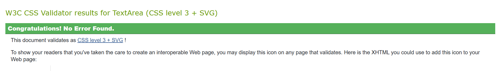
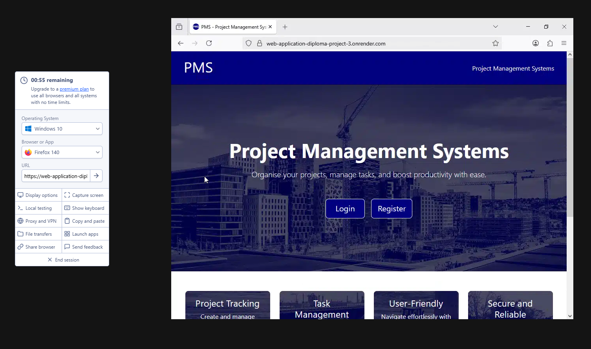

# Testing

> [!NOTE]
> Return back to the [README.md](/README.md) file.

### Python

I have used the [PEP8 Code Institute Validator](https://pep8ci.herokuapp.com/) to validate all of my py files.

| Directory | File | URL | Screenshot |
| --- | --- | --- | --- |
| projects | projects-forms.py | --- |  |
| projects | projects-models.py | --- |  |
| projects | projects-test_projects_buttons.py | --- |  |
| projects | projects-tests.py | --- |  |
| projects | projects-urls.py | --- |  |
| projects | projects-views.py | --- |  |
| tasks | tasks-forms.py | --- |  |
| tasks | tasks-models.py | --- |  |
| tasks | tasks-test_tasks_buttons.py | --- |  |
| tasks | tasks-tests.py | --- |  |
| tasks | tasks-urls.py | --- |  |
| tasks | tasks-views.py | --- |  |
| users | users-backends.py | --- |  |
| users | users-forms.py | --- |  |
| users | users-test_users.py | --- |  |
| users | users-tests.py | --- |  |
| users | users-urls.py | --- |  |
| users | users-views.py | --- |  |

### CSS

I have used the [CSS Jigsaw Validator](https://jigsaw.w3.org/css-validator) to validate all of my CSS files.

| Directory | File | URL | Screenshot |
| --- | --- | --- | --- |
| static | assets/stylesheets/authentication.css | --- |  |
| static | assets/stylesheets/base.css | --- |  |
| static | assets/stylesheets/components.css | --- |  |
| static | assets/stylesheets/homepage.css | --- |  |

## Responsiveness

I've tested my deployed project to check for responsiveness issues.

| Page | Mobile | Tablet | Desktop | Notes |
| --- | --- | --- | --- | --- |
| Homepage |  |  |  | Works as expected |
| Login and Register |  |  |  | Works as expected |
| Projects list |  |  |  | Works as expected |

## Browser Compatibility

I've tested my deployed project on multiple browsers to check for compatibility issues.

| Browser | Homepage | Login/Register | Projects |
| --- | --- | --- | --- |
| Google |  |  |  | Works as expected |
| Firefox |  |  |  | Works as expected |

## Lighthouse Audit

| Page | Mobile | Desktop |
| --- | --- | --- |
| Homepage |  |  |
| Login and Register |  |  |
| Projects |  |  |
| Tasks |  |  |

# Testing Report

## Overview

I used my created tests.py files to run application tests:

- **Total tests run:** 38  
- **Test duration:** ~50 seconds  
- **Test result:** All tests passed (OK)  

## My tests.py files can be found on the following links :-
- **Projects** [tests.py](./projects/tests.py)
- **Tasks** [tests.py](./tasks/tests.py)
- **Users** [tests.py](./users/tests.py)

# Test Reports

## I have wrote separate functionality tests to test all the buttons in the project, task and user apps.

**You can view the full test report here:**
| Function Test Report | Screenshot |
| --- | --- |
| Html Report |  |

